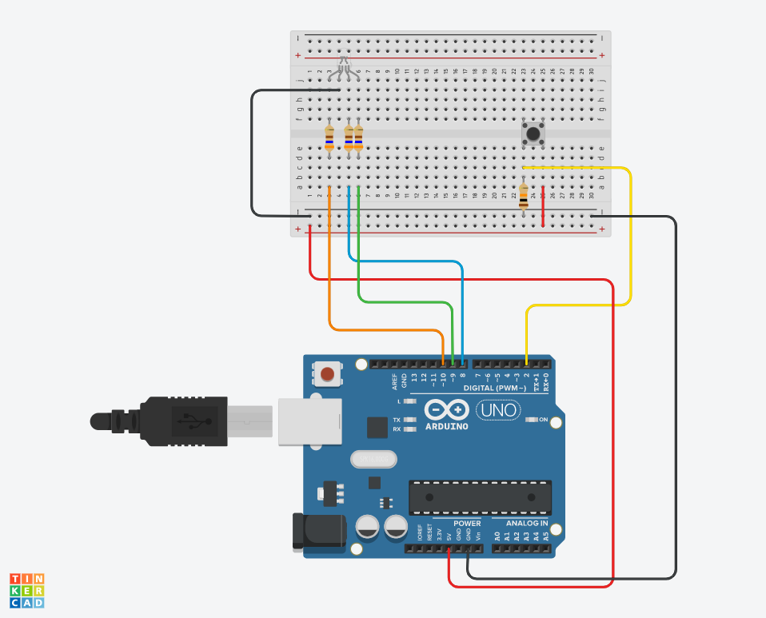

# RGB-button

This is a code that takes a input from a button that makes a RGB-light light in diffrent colors evertime you push the button. 

## Circuit Diagram

## Equipment

- Arduino UNO
- Bread board
- Button
- RGB-LED
- 360 ohm resistors
- 10k ohm Resistor (Pull upp resistor)

## About me

Isabel Hammarström, A third year student at Tullinge gymnasium.
isabel.hammarstrom@skola.botkyrka.se